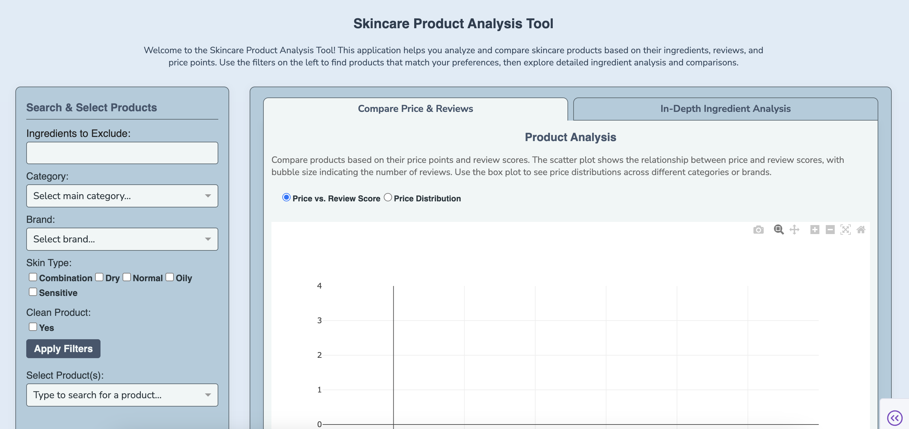

# Skincare Ingredient Analyzer

An interactive web dashboard for in-depth skincare product analysis, allowing users to filter by ingredients, compare products based on price and reviews, and perform deep dives into ingredient composition and similarity.

**[➡️ View Live Demo Here](https://your-app-name.onrender.com)** 

This dashboard empowers users to make informed decisions about skincare products through an interactive interface.

### 1. Comprehensive Filtering Panel

A single, unified control panel on the left allows users to precisely filter a comprehensive product database:

* **Ingredients to Exclude:** Specify personal allergens or undesirable ingredients to instantly remove non-compliant products.
* **Multi-Select Category & Brand:** Narrow down the search by one or more product types and brands.
* **Skin Type:** Filter for products suitable for one or more skin types (`Combination`, `Dry`, `Normal`, `Oily`, `Sensitive`).
* **"Clean" Product Status:** Instantly view only products designated as "Clean at Sephora."
* **Product Selector:** After applying filters, a dropdown is populated with all matching products, which can be multi-selected for visualization and analysis.

### 2. Dynamic Analysis & Visualization Tabs

The main content area on the right features two tabs:

#### Tab 1: Compare Price & Reviews

Visualize the market landscape for your filtered products. This tab is designed for comparative analysis of key product metrics.

* **Scatter Plot:** An interactive scatter plot visualizes the relationship between product **Price**, **Review Score**, and **Popularity** (`n_of_loves`), with bubble size representing the number of reviews.
* **Box Plot:** Functionality to switch to a box plot view to analyze price distributions across either brands or categories.

#### Tab 2: In-Depth Ingredient Analysis

Select a single product from your filtered list to perform a detailed investigation. A toggle allows you to switch between different analysis modes for the selected product:

* **Allergens & Interactions:** View a list of potential allergens and critical ingredient interaction warnings found within the product's formulation.
* **Ingredient Details & Functions:** View a detailed table of every ingredient, including its expert rating and functional categories (e.g., Emollient, Antioxidant), sourced from Paula's Choice. 
* **Formulation Profile:** Visualize the functional category breakdown of a product's ingredients in an interactive sunburst chart. A bar chart displays the ingredient category proportions (e.g., 30% Emollients, 20% Antioxidants), offering a quantitative look at the product's composition.


## Tech Stack

* **Backend & Frontend:** Python, [Dash](https://dash.plotly.com/)
* **Data Manipulation:** [Pandas](https://pandas.pydata.org/)
* **Visualizations:** [Plotly Express](https://plotly.com/python/plotly-express/)
* **Deployment:** Hosted on [Render](https://render.com/) via Gunicorn

## Data & Preprocessing Workflow

The final dataset used by the Dash app is the result of a comprehensive data collection, cleaning, and feature engineering pipeline. This ensures the data is clean, consistent, and enriched for detailed analysis.

### Data Sources

1.  **Sephora Product Data:** This dataset contains information on thousands of skincare products, including their brand, name, price, number of reviews, number of loves, clean product status, and category. (skincare_df.csv)
    * https://www.kaggle.com/datasets/thedevastator/skincare-products-that-perform-the-best-at-sepho
2.  **Skincare Ingredient Data:** An additional Kaggle dataset used to augment the primary product list with additional categorization, skin preference, and list of ingredients. (cosmetics.csv)
    * https://www.kaggle.com/datasets/kingabzpro/cosmetics-datasets/data
4.  **Paula's Choice Ingredient Details:** A comprehensive dataset containing detailed information on thousands of cosmetic ingredients, including ratings, descriptions, and functional categories. (Paula_embedding_SUMLIST_before_422.csv, pre_alternatives.csv)
     * https://www.kaggle.com/datasets/autumndyer/skincare-products-and-ingredients

### Preprocessing Pipeline

The following scripts are used to process the raw data into the final files used by the app. They are designed to be run in sequence.

**Step 1: Initial Inspection, Cleaning & Merging**
* **Files:** `product_data_inspect.py`, `skincare_products_inspect.py`
* **Process:** This initial phase involves loading the raw data sources and performing exploratory data analysis (EDA) to understand distributions and data quality. Key steps include:
    * Standardizing brand and product names using regex and fuzzy matching (Levenshtein distance) to create consistent keys for merging.
    * Merging the primary Sephora dataset with the supplementary skincare dataset.
    * Inspecting for and handling data mismatches.
* **Output:** An intermediate merged dataset (`final_merged_products.csv`).

**Step 2: Product Feature Engineering**
* **File:** `product_data_prep.py`
* **Process:** This script takes the merged data and performs feature engineering to create analysis-ready columns.
    * It reconciles multiple category columns into a single, unified `category` field.
    * It creates a categorical popularity tier (`n_of_loves_bin`) by binning the numerical `n_of_loves` count, complete with descriptive labels for use in visualizations.
* **Output:** A further processed intermediate DataFrame.

**Step 3: Ingredient Data Integration**
* **File:** `ingredient_data_prep.py`
* **Process:** This script enriches the product data with detailed ingredient information.
    * It processes the raw, semi-structured ingredient strings for each product into a standardized list.
    * It maps each cleaned ingredient to the comprehensive Paula's Choice ingredient dictionary.
    * It creates the vital `paula_ingredient_details` column, which contains a JSON-like structure of detailed information for every ingredient in a product.
* **Output:** The final, primary dataset used by the app: `data/final_products_ingredients.csv`.

## Setup and Local Installation

To run this application on your local machine, follow these steps:

1.  **Clone the Repository:**
    ```bash
    git clone [https://github.com/avalone713/Skincare-Product-Analyzer.git](https://github.com/avalone713/Skincare-Product-Analyzer.git)
    cd Skincare-Product-Analyzer
    ```

2.  **Create and Activate a Virtual Environment:**
    ```bash
    # For Mac/Linux
    python3 -m venv venv
    source venv/bin/activate

    # For Windows
    python -m venv venv
    .\venv\Scripts\activate
    ```

3.  **Install Dependencies:**
    ```bash
    pip install -r requirements.txt
    ```

4.  **Run the App:**
    ```bash
    python Skincare_Product_Analyzer.py
    ```

    The app will be available at `http://127.0.0.1:8050` in your web browser.

---
